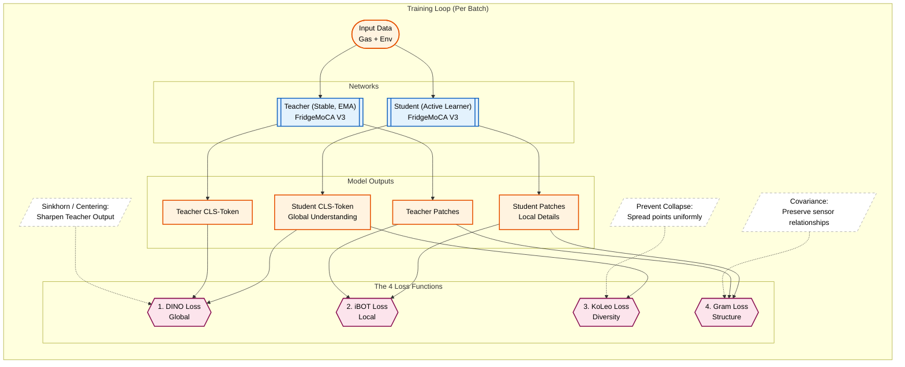

```mermaid
graph TD
    %% Styling for dark text
    classDef net fill:#e3f2fd,stroke:#1565c0,stroke-width:2px,color:#000;
    classDef data fill:#fff3e0,stroke:#e65100,stroke-width:2px,color:#000;
    classDef loss fill:#fce4ec,stroke:#880e4f,stroke-width:2px,color:#000;
    classDef desc fill:#ffffff,stroke:#9e9e9e,stroke-width:1px,stroke-dasharray: 5 5,color:#000;

    subgraph Training_Loop ["Training Loop (Per Batch)"]
        direction TB
        
        INPUT([Input Data<br/>Gas + Env]):::data
        
        subgraph Networks ["Networks"]
            STUDENT[["Student (Active Learner) <br/> FridgeMoCA V3"]]:::net
            TEACHER[["Teacher (Stable, EMA) <br/> FridgeMoCA V3"]]:::net
        end
        
        INPUT --> STUDENT
        INPUT --> TEACHER

        %% Outputs
        subgraph Outputs ["Model Outputs"]
            S_CLS[Student CLS-Token<br/>Global Understanding]:::data
            S_PATCH[Student Patches<br/>Local Details]:::data
            
            T_CLS[Teacher CLS-Token]:::data
            T_PATCH[Teacher Patches]:::data
        end

        STUDENT --> S_CLS
        STUDENT --> S_PATCH
        TEACHER --> T_CLS
        TEACHER --> T_PATCH

        %% LOSSES
        subgraph Loss_Functions ["The 4 Loss Functions"]
            direction TB
            
            L_DINO{{1. DINO Loss<br/>Global}}:::loss
            L_IBOT{{2. iBOT Loss<br/>Local}}:::loss
            L_KOLEO{{3. KoLeo Loss<br/>Diversity}}:::loss
            L_GRAM{{4. Gram Loss<br/>Structure}}:::loss
        end

        %% Connections
        S_CLS --> L_DINO
        T_CLS --> L_DINO
        
        S_PATCH --> L_IBOT
        T_PATCH --> L_IBOT
        
        S_CLS --> L_KOLEO
        
        S_PATCH --> L_GRAM
        T_PATCH --> L_GRAM
        
        %% Explanations
        D_DESC[/"Sinkhorn / Centering:<br/>Sharpen Teacher Output"/]:::desc
        D_DESC -.-> L_DINO
        
        K_DESC[/"Prevent Collapse:<br/>Spread points uniformly"/]:::desc
        K_DESC -.-> L_KOLEO

        G_DESC[/"Covariance:<br/>Preserve sensor relationships"/]:::desc
        G_DESC -.-> L_GRAM

    end
```
