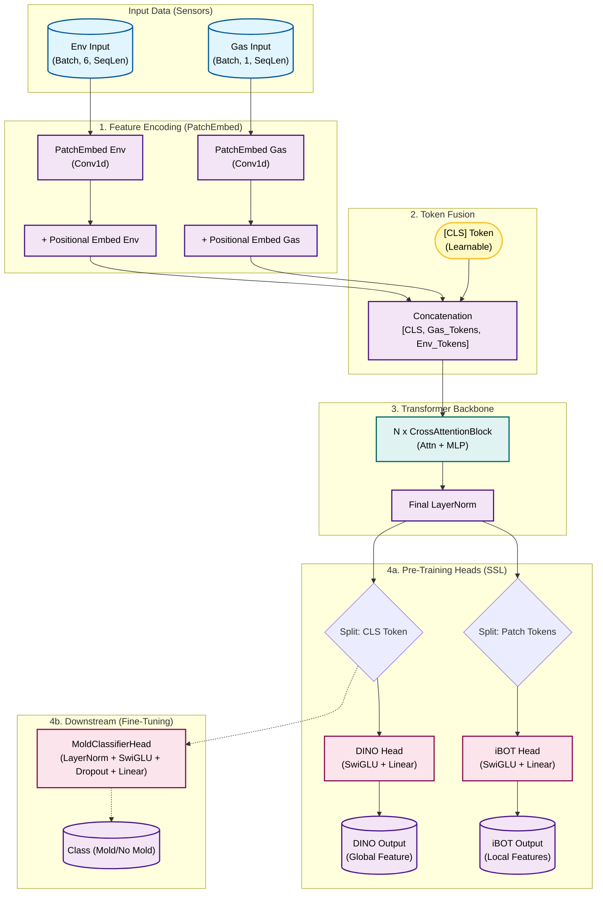

```mermaid
graph TD
    %% Define Styles
    classDef input fill:#e1f5fe,stroke:#01579b,stroke-width:2px,color:#000;
    classDef process fill:#f3e5f5,stroke:#4a148c,stroke-width:2px,color:#000;
    classDef token fill:#fff9c4,stroke:#fbc02d,stroke-width:2px,color:#000;
    classDef block fill:#e0f2f1,stroke:#00695c,stroke-width:2px,color:#000;
    classDef head fill:#fce4ec,stroke:#880e4f,stroke-width:2px,color:#000;

    subgraph Inputs ["Input Data (Sensors)"]
        direction TB
        GAS[("Gas Input<br/>(Batch, 1, SeqLen)")]:::input
        ENV[("Env Input<br/>(Batch, 6, SeqLen)")]:::input
    end

    subgraph Encoding ["1. Feature Encoding (PatchEmbed)"]
        direction TB
        PE_GAS["PatchEmbed Gas<br/>(Conv1d)"]:::process
        PE_ENV["PatchEmbed Env<br/>(Conv1d)"]:::process
        
        POS_GAS["+ Positional Embed Gas"]:::process
        POS_ENV["+ Positional Embed Env"]:::process
    end

    subgraph Fusion ["2. Token Fusion"]
        CLS(["[CLS] Token<br/>(Learnable)"]):::token
        CONCAT["Concatenation<br/>[CLS, Gas_Tokens, Env_Tokens]"]:::process
    end

    subgraph Backbone ["3. Transformer Backbone"]
        direction TB
        CAB["N x CrossAttentionBlock<br/>(Attn + MLP)"]:::block
        LN["Final LayerNorm"]:::process
    end

    subgraph Heads_Pretrain ["4a. Pre-Training Heads (SSL)"]
        direction TB
        SPLIT_CLS{"Split: CLS Token"}
        SPLIT_PATCH{"Split: Patch Tokens"}
        
        DINO["DINO Head<br/>(SwiGLU + Linear)"]:::head
        IBOT["iBOT Head<br/>(SwiGLU + Linear)"]:::head
        
        OUT_DINO[("DINO Output<br/>(Global Feature)")]:::process
        OUT_IBOT[("iBOT Output<br/>(Local Features)")]:::process
    end
    
    subgraph Heads_Classify ["4b. Downstream (Fine-Tuning)"]
        MCH["MoldClassifierHead<br/>(LayerNorm + SwiGLU + Dropout + Linear)"]:::head
        OUT_CLASS[("Class (Mold/No Mold)")]:::process
    end

    %% Flow Connections
    GAS --> PE_GAS
    ENV --> PE_ENV

    PE_GAS --> POS_GAS
    PE_ENV --> POS_ENV

    CLS --> CONCAT
    POS_GAS --> CONCAT
    POS_ENV --> CONCAT

    CONCAT --> CAB
    CAB --> LN

    LN --> SPLIT_CLS
    LN --> SPLIT_PATCH

    %% Pre-Training Flow
    SPLIT_CLS --> DINO
    SPLIT_PATCH --> IBOT
    DINO --> OUT_DINO
    IBOT --> OUT_IBOT

    %% Classification Flow (Optional/Phase 2)
    SPLIT_CLS -.-> MCH
    MCH -.-> OUT_CLASS
```