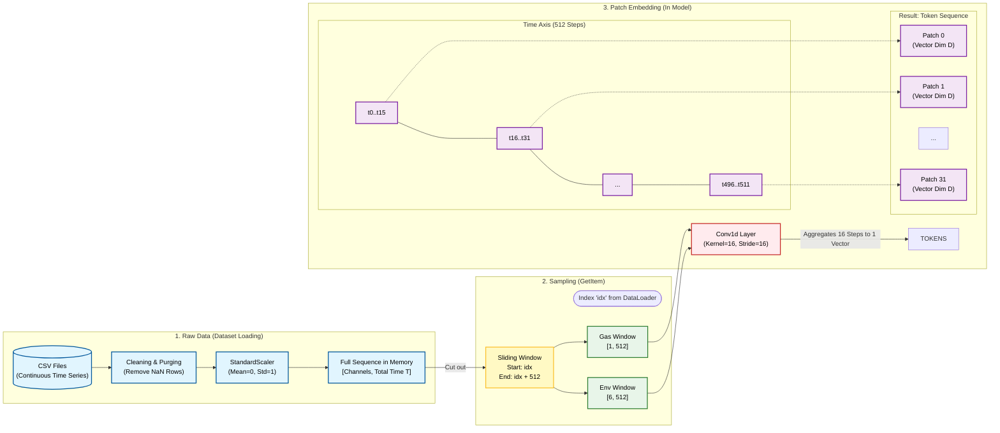

```mermaid
flowchart LR
    %% Styles
    classDef raw fill:#e1f5fe,stroke:#01579b,stroke-width:2px,color:#000;
    classDef window fill:#fff9c4,stroke:#fbc02d,stroke-width:2px,color:#000;
    classDef tensor fill:#e8f5e9,stroke:#2e7d32,stroke-width:2px,color:#000;
    classDef patch fill:#f3e5f5,stroke:#7b1fa2,stroke-width:2px,color:#000;
    classDef embed fill:#ffebee,stroke:#c62828,stroke-width:2px,color:#000;

    subgraph Step1_Raw ["1. Raw Data (Dataset Loading)"]
        direction TB
        CSV[("CSV Files<br/>(Continuous Time Series)")]:::raw
        CLEANING["Cleaning & Purging<br/>(Remove NaN Rows)"]:::raw
        NORM["StandardScaler<br/>(Mean=0, Std=1)"]:::raw
        FULL_SEQ["Full Sequence in Memory<br/>[Channels, Total Time T]"]:::raw
        
        CSV --> CLEANING --> NORM --> FULL_SEQ
    end

    subgraph Step2_Window ["2. Sampling (GetItem)"]
        direction TB
        IDX(["Index 'idx' from DataLoader"])
        SLIDE["Sliding Window<br/>Start: idx<br/>End: idx + 512"]:::window
        
        WINDOW_GAS["Gas Window<br/>[1, 512]"]:::tensor
        WINDOW_ENV["Env Window<br/>[6, 512]"]:::tensor
        
        FULL_SEQ -- "Cut out" --> SLIDE
        SLIDE --> WINDOW_GAS
        SLIDE --> WINDOW_ENV
    end

    subgraph Step3_Patching ["3. Patch Embedding (In Model)"]
        direction TB
        
        %% Visualization of time steps
        subgraph Time_Axis ["Time Axis (512 Steps)"]
            direction LR
            T0["t0..t15"]:::patch --- T1["t16..t31"]:::patch --- T2["..."]:::patch --- T3["t496..t511"]:::patch
        end

        CONV["Conv1d Layer<br/>(Kernel=16, Stride=16)"]:::embed
        
        WINDOW_GAS --> CONV
        WINDOW_ENV --> CONV
        
        CONV -- "Aggregates 16 Steps to 1 Vector" --> TOKENS
        
        subgraph Tokens ["Result: Token Sequence"]
            P0["Patch 0<br/>(Vector Dim D)"]:::patch
            P1["Patch 1<br/>(Vector Dim D)"]:::patch
            P_DOT["..."]
            P31["Patch 31<br/>(Vector Dim D)"]:::patch
        end
    end

    %% Visualize connections
    T0 -.-> P0
    T1 -.-> P1
    T3 -.-> P31
```
